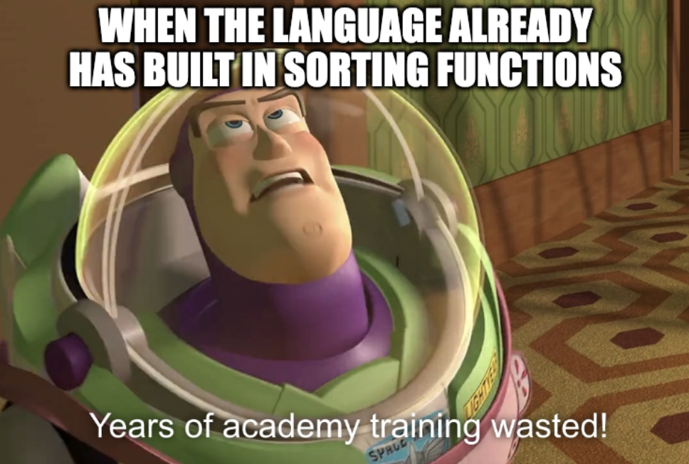

# Exercise 10.2 - ⛙ Merge Sort

## 🎯 Objectives

- **Implement** a recursive merge sort algorithm in Java.

## 🔨 Setup

1. Clone the repo (or download the zip) for this exercise, which you can find [here](https://github.com/JAC-CS-Programming-4-W23/E10.2-Merge-Sort).
2. Start IntelliJ, go to `File -> Open...`, and select the cloned/downloaded folder.
3. If at the top it says "Project JDK is not defined", click "Setup JDK" on the top right, and select the JDK version you have installed on your machine.

   

4. To get the unit tests to work, open `TestMaps.java` and add JUnit to the classpath:

   

   - Just click "OK" on the resulting dialogue window and all the test-related red squigglies should disappear.

## 🔍 Context

Merge sort is a recursive sorting algorithm that is known for being efficient. It's especially useful when sorting data stored in structures that have slow random access like files or chains.


Conceptually, a merge sort works as follows[^1]:

1. Divide the unsorted list into $n$ sublists, each containing one element (a list of one element is considered sorted).
2. Repeatedly merge sublists to produce new sorted sublists until there is only one sublist remaining. This will be the sorted list.

## 🚦 Let's Go

Before we tackle the sort algorithm, let's implement the method `merge()`. It does most of the work in the algorithm!

### Merge

A **merge** takes two sorted array slices and combines them into a third slice in such a way that the elements are sorted.

[^2]

The setup is based on how we plan on calling `merge()` from withing the sort:

- The two slices are next to each other in the array `source[left..mid]` and `source[mid+1..right]`. We call them **contiguous**.
- Precondition 1: `left < mid` and `mid + 1 < right`.
- Precondition 2: slice `source[left..mid]` and `source[mid+1..right]` are sorted ascending.
- The merged elements are put into `destination`.

```java
<T extends Comparable<T>> void merge(T[] source, int left, int mid, int right, T[] destination)
```

### Binary Search

This idea of splitting an array into left and right should be very familiar when thinking about binary search. Here's how we can implement binary search recursively:

1. Base case: start index is greater than end index.
2. Calculate the middle index.
3. If the middle element is the target, return its index.
4. If the target is less than the middle element, (recursively) search the left half of the array.
5. If the target is greater than the middle element, (recursively) search the right half of the array.

```java
<T extends Comparable<T>> int binarySearch(T[] elements, T target, int start, int end)
```

## 🔬 Observations

- What do you think the Big O complexity of merge sort is?
- Is it possible to implement merge sort nonrecursively? If so, how?
- Is recursive binary search and better or worse than non-recursive binary search?

---

[^3]

[^1]: https://en.wikipedia.org/wiki/Merge_sort
[^2]: https://www.globalsoftwaresupport.com/parallel-merge-sort/
[^3]: https://www.smbc-comics.com/comic/recursion
